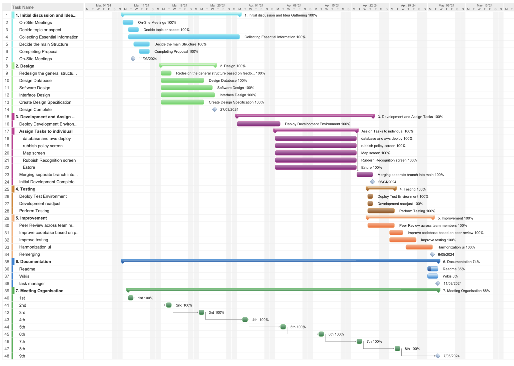
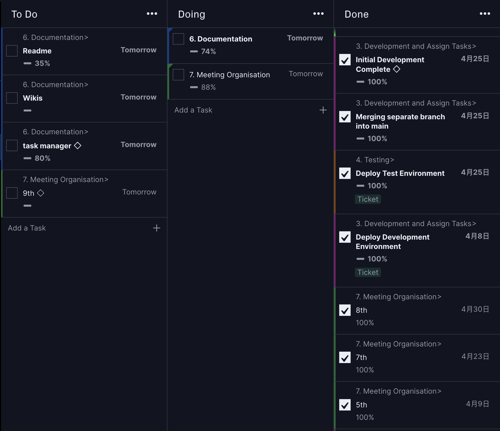

# COMPSCI 732 / SOFTENG 750 project - Team Happy Herons
<br>
<br>

### 04/16/2024 description
- `gitignore` file is added
- `Tailwind CSS` is added and configured

<br>

- use following command to clone the project
```bash
git clone https://github.com/UOA-CS732-SE750-Students-2024/project-group-happy-herons.git
```

- use following command to install all the dependencies
```bash
cd Group-Happy-Herons-Project
npm install
```

<br>
<br>
<br>
<br>
<br>
<be>
  

  
Welcome to the project! I look forward to seeing your progress and your final results this semester!

Your team members are:
- Xiangnan Lu
- Zheyang Cao
- Jinquan Wen
- Xin Yue
- Ze Yin
- Yan Li


## Technologies
### Image Recognition and Information Retrieval

This section of our project describes the integration of TensorFlow.js with React Native for offline image recognition, and the utilization of the ChatGPT API for online information retrieval. The functionality facilitates rubbish classification and provides users with detailed information about identified items.And the modes are controlled by users and internet connections.

#### Image Selection Process

Before processing any images for classification, users must select an image either from their device's camera or from their photo library. This functionality is managed by the UploadOptions component and uses  `expo-image-picker` library to facilitate image capturing and selection.

- Camera Access: Allows users to take a new photo using their device's camera.
- Library Access: Users can select an existing photo from their device's media library.
- Permissions: Automatically requests and checks necessary permissions for camera and library access.

***This example demonstrate how to use `launchCameraAsync` method to capture an image,request permissions if necessary, and handle the image data***

```jsx
import {launchCameraAsync,useCameraPermissions,PermissionStatus,} from "expo-image-picker";
  async function takeImageHandler() {
    const hasPermission = await verifyPermissions();
    if (!hasPermission) {
      return;
    }
    const image = await launchCameraAsync({
      allowsEditing: true,
      aspect: [16, 9],
      quality: 0.85,
      base64: true,
    });
    if (!image.canceled) {
      onTakeImage(image.assets[0].uri, image.assets[0].base64);
      setPickedImage(image.assets[0].uri);
    }
  }
```


#### Offline Mode


The TensorFlow.js model is used within the React Native app to classify images of rubbish directly on the user's device, operating fully offline.

- TensorFlow.js is integrated using the @tensorflow/tfjs-react-native adapter, allowing the machine learning model to run directly on mobile devices without needing internet access.

- The model is pre-trained and bundled with the app, enabling instant image processing and classification.

The model is loaded asynchronolously when the app starts and the useModel hook (as shown below) initializes TensorFlow.js, loads the model from local assets, and sets up the model for use in the app.
```jsx
import * as tf from "@tensorflow/tfjs";
import { bundleResourceIO } from "@tensorflow/tfjs-react-native";
export const useModel = () => {
  const [model, setModel] = useState(null);
  useEffect(() => {
    async function loadModel() {
      try {
        await tf.ready();
        const modelJson = require("../assets/model/model.json");
        const modelWeights = [
          require("../assets/model/group1-shard1of11.bin"),
        ];
        const loadedModel = await tf.loadGraphModel(bundleResourceIO(modelJson, modelWeights));
        setModel(loadedModel);
      } catch (error) {
        console.error("Failed to load the model:", error);
      } }
    loadModel();
  }, []);
```
#### Online Mode

In online mode, the application uses the OpenAI GPT-4 Turbo model to provide detailed disposal instructions for identified items. This feature requires an internet connection and utilizes the ChatGPT API to process images and return actionable information based on the image content.

The function constructs an HTTP POST request using `axios` with a set of headers including the `API key`. The request payload specifies that the model should treat the incoming image URL (embedded as a base64 string) and provide disposal instructions based on predefined criteria.


To use this function, pass a base64 encoded image to sendImageToOpenAI. It returns a JSON response containing the appropriate disposal method and brief instructions, formatted as specified as shown in below code.

```jsx
import axios from 'axios';

async function sendImageToOpenAI(imageBase64) {
  if (!imageBase64) {
    throw new Error("No image provided");
  };
  const headers = {
    'Content-Type': 'application/json',
    'Authorization': `Bearer ${process.env.OPEN_AI_API_KEY}` 
  };
  const payload = {
    model: "gpt-4-turbo",
    messages: [
      {
        role: "user",
        content: [
          {
            type: "text",
            text: "Provide disposal instructions for the item shown in the picture.",
          },
          {
            type: "image_url",
            image_url: `data:image/jpeg;base64,${imageBase64}`
          }],},],
    max_tokens: 100
  };
  try {
    const response = await axios.post('https://api.openai.com/v1/chat/completions', payload, { headers });
    return response.data;
  } catch (error) {
  };
};
```


## Project Management
  
### Team Collaboration and Meetings

- Regular Meetings: Our team held weekly meetings every Tuesday (adjust depending on individual needs or progress) online or on campus to discuss project progress, address any issues, and plan for the upcoming week. Meeting minutes are available in the Wiki section of our GitHub repository.
  
- Communication Tools: We used WeChat for daily communication and projectManager (as shown in the below image) to track tasks and deadlines and ensure all team members stayed informed and engaged.

### Version Control and Workflow

- Git Workflow: We adopted the branch workflow. This approach helped us manage the development of new features without disturbing the main codebase. Each feature was developed in a separate branch and reviewed through pull requests before merging into the main.

- Code Reviews: Pull requests were used to review all code changes. This practice ensured code quality and shared understanding of the codebase among team members.

### Task Management

- Task Assignment: Tasks were assigned during our first couple of weekly meetings based on team members' skills and learning goals. The  details can be found on our projectManager board, which reflects the current status of each task, including 'To Do,' 'Doing,' and 'Done.'
- 
- Progress Tracking: Progress was tracked using ProjectManager, where team members regularly updated tasks.

### Quality Assurance

- Code Reviews: All pull requests underwent thorough reviews by at least two other team members before merging to ensure quality and consistency.

### Regular Contributions and Commits

- Commit Logs: Our commit logs reflect regular contributions from all team members. Each commit clearly describes the implemented changes, ensuring traceability and transparency.

- Peer Reviews: Each piece of code was peer-reviewed, fostering knowledge sharing and collective code ownership.
